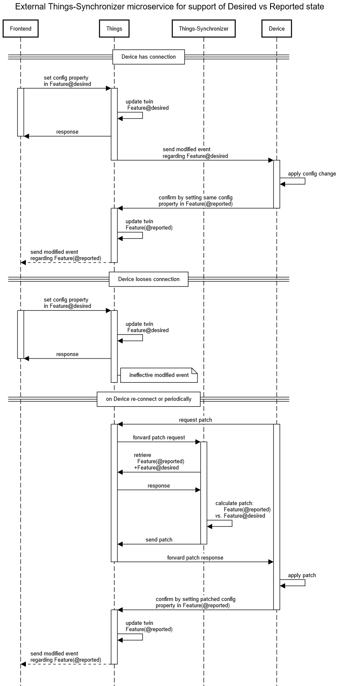

# Bosch IoT Things - Synchronizer concept to support Desired vs Reported state of Devices

This concept shows a simple implementation and usage scenario for an integration of IoT devices with Bosch IoT Things / Eclipse Ditto that is based on distinguishing between the current reported state of device information and a desired, target state for that device. This is mainly required for configuration parameters of devices that are connected either sporadically or unstably. Devices that are used for telemetry data ingestion only or devices that are connected very reliable without interruptions may not need such an approach.

There is a discussion in [ditto#125](https://github.com/eclipse/ditto/issues/125) on how this concept can be integrated
as a core functionality of Bosch IoT Things / Eclipse Ditto.

# Chosen approach

Whenever an IoT application has to distinguish between the two perspectives "desired" and "reported" (current) state of an IoT device it should maintain these two perspectives within the same Thing that represents the device.

This can be done by using pairs of Features - one that represents the current state and a second that represents the desired state. By using a naming convention we accompany each Feature "abc" which holds the current state with a Feature "abc@desired" that holds the desired/target state. In general the @desired feature only contains configuration properties (e.g. thresholds) and no status properties (e.g. temperature).

This picture shows this approach:

IoT applications can use either one of these Features. To see the current, last reported state they access the Feature "abc". To set the desired state they write to Feature "abc@desired".

The IoT devices themselves should also be aware of these two perspectives.
There are two situations they should handle:
- if a device gets informed about modifications of the @desired Feature it should try to apply these changes (e.g. configure a threshold value). After this and in order to reflect the fact that it now knows the new configuration value it should confirm this by publishing a modification of the same configuration property to the "reported" state. When a IoT application looks at the Things it would then see both perspectives "in sync", i.e. the reported and the desired configuration property have the same value.
- as devices may miss notifications about modifications of the @desired Feature (i.e. when they are offline), the device should either regularly or at least when it recovers it's online connectivity trigger a synchronization. This synchronization is based on the request to receive a "patch" document that contains all differences between the reported state and the desired state. When the device receives the patch document it can apply the contained changes and confirm them by publishing the respective modifications to the reported state. On the next synchronization, it then would retrieve an empty patch document that indicates that everything is already "in sync".

The functionally to determine this patch is currently not included in Bosch IoT Things / Eclipse Ditto but is provided as a separate microservice within this example that is integrated into the Thing API. The invocation is triggered by sending a message with subject "determineDesiredPatch" and responds with a JSON patch document (see [IETF RFC 6902](https://tools.ietf.org/html/rfc6902)).

The following sequence diagram shows the interaction between device, Bosch IoT Things / Eclipse Ditto, the example synchronizer microservice and an IoT application frontend:

# License
See the iot-things-examples top level README.md file for license details.
